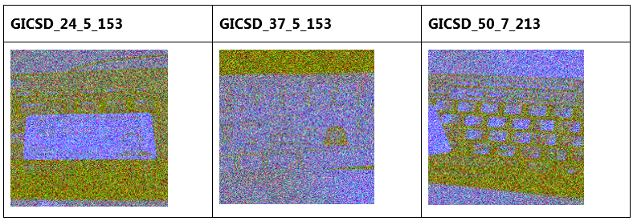

***


# Classifying visibility of ID cards in photos

Implementation of multiclass image classifier for identifying visibility of ID cards on corrupted images
utilizing CNN architecture with a pretrained backbone network and Keras/Tensorflow.

Input image example:  


Output labels example:  


The project includes:
 - a [notebook](notebooks/House_of_ID_Cards.html) with data exploration, model training and evaluation of the performance;
 - a script for training teh model or predicting in new input.

## Approach

As a quick baseline I have used multilogit regression  without any extra transformations on the images, which yielded AUC of 0.63 on the training set, 
further oversampling and augmentation didn't raise the score much higher. 

The main approach to modelling would be to use a Convolutional Neural Network which can extract regional information and is much more robust to variations in the images. 
Given the time limitations of the task, relatively small amount of images we have (only 800 images in total of which 600 fall into training set) 
and strong variations in the background that is not evenly distributed among target classes, 
the best course of action would be to apply transfer learning so that the network can build on the already trained layers that recognize shapes, textures and forms. 
As a backbone I used ResNet50, which provides a deeper network at smaller computational expense by introducing skip connections 
which also mitigate the problem of vanishing gradient.

The backbone is followed by three Dense layers with dropout for regularization and a dense output layer with softmax activation.   
Loss: Categorical cross entropy.
    
## Data

original dataset comes from https://arxiv.org/abs/1807.05786 -- MIDV-500 A Dataset for Identity Documents Analysis and Recognition on Mobile Devices in Video Stream.  

### 1) images
A folder containing pictures of different types of ID documents taken in different conditions and backgrounds. Pictures are corrupted.

### 2) gicsd_labels.csv
A CSV file mapping each challenge image with its correct label.  
	- **IMAGE_FILENAME**: The filename of each image.  
	- **LABEL**: The label of each image, which can be one of these values: FULL_VISIBILITY, PARTIAL_VISIBILITY or NO_VISIBILITY. 

## Dependencies

pip install tensorflow==2.0.0  
pip install tensorflow-gpu==2.0.0  
pip install keras==2.3.1  
pip install pandas==0.25.3  
pip install numpy==1.17.4  
pip install scikit-learn==0.22  
pip install scikit-image==0.16.2  
pip install matplotlib==3.1.2  

## Run Instructions

1. Go to directory `code`, there you will find the main.py file  
2. To run model training use the following command:  

```
$ python main.py --mode=train --img_dir=</path/to/directory/containing/images/> \
                              --metadata_dir=</path/to/directory/containing/gicsd_labels.csv/ (e.g. ../data/)> \
							  --out_dir=</path/to/directory/where/model.hdf5/file/will/be/saved>
```
							  
3. To run model training use the following command:  
```
$ python main.py --mode=predict --path_to_image=</pah/to/image/ (e.g. ../data/images/GICSD_26_7_213.png)> \
                                --model_location=</pah/to/model.hdf5 (e.g. ../artifacts/prod_resnet50_oversampling_model.h5)>
```

## Future Work

Preprocessing:

- Create custom generator with Balanced Batch as well as more augmentation functions than keras ImageDataGenerator supports 
  (e.g. gaussian noise). 
- The images a somewhat blurry, adding resolution improvement may help.

Model and model optimization:  

- Add background_id as another input to the network. 
  !Caution, this may decrease generalizability of the model if new background classes would be introduced.  
- Add learning rate decay.
- Add early stopping to prevent overfitting.
- Create a Deep CNN architecture from scratch, train it on more epochs.

Code:
- Configure logging.
- Add unit tests.
- Dockerize the application.
- Add REST API for predictions.
